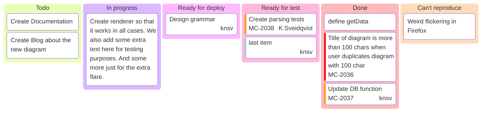
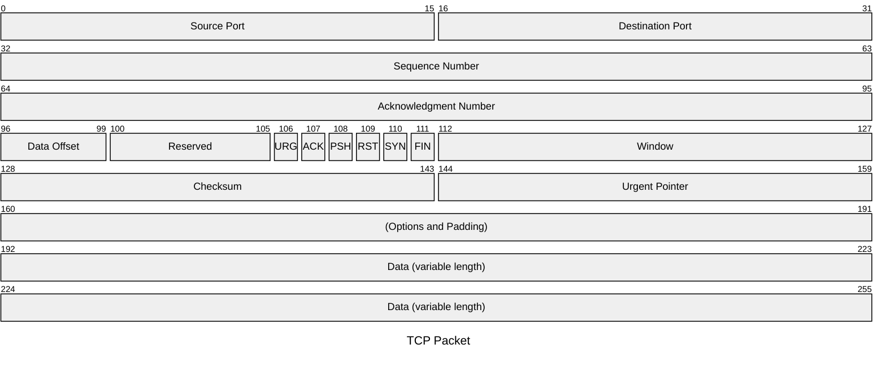
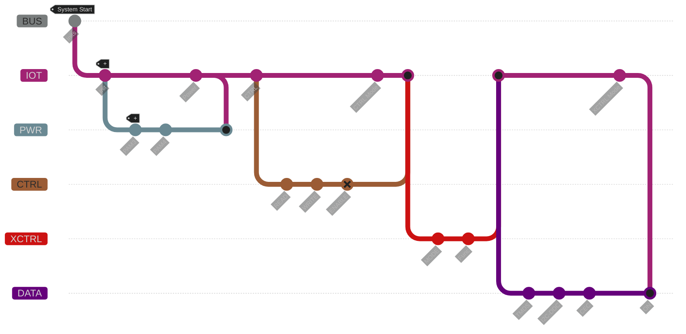
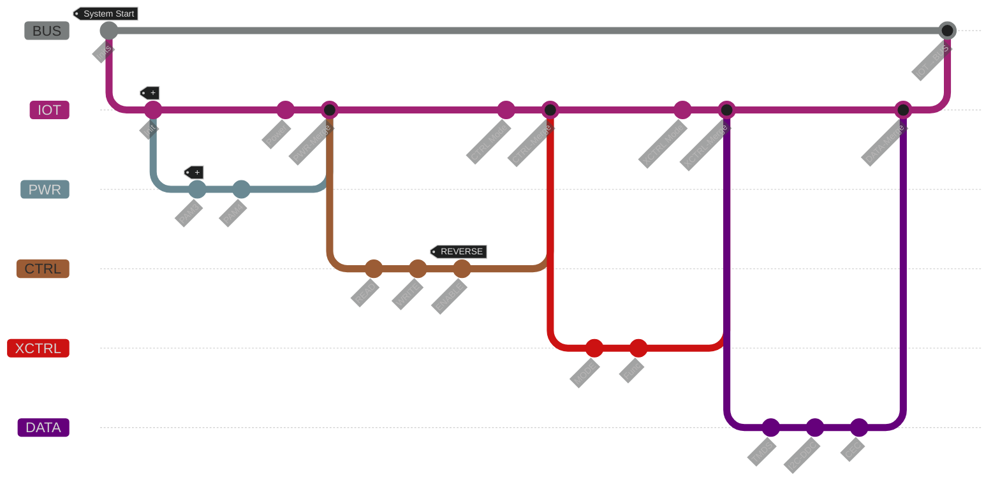

import Tables from '@site/src/components/Tables';

{/* 

<PanzoomViewer selector=".mermaid > svg" /> */}

```mermaid
kanban
  Todo
    [Create Documentation]
    docs[Create Blog about the new diagram]
  [In progress]
    id6[Create renderer so that it works in all cases. We also add some extra text here for testing purposes. And some more just for the extra flare.]
  id9[Ready for deploy]
    id8[Design grammar]@{ assigned: 'knsv' }
  id10[Ready for test]
    id4[Create parsing tests]@{ ticket: MC-2038, assigned: 'K.Sveidqvist', priority: 'High' }
    id66[last item]@{ priority: 'Very Low', assigned: 'knsv' }
  id11[Done]
    id5[define getData]
    id2[Title of diagram is more than 100 chars when user duplicates diagram with 100 char]@{ ticket: MC-2036, priority: 'Very High'}
    id3[Update DB function]@{ ticket: MC-2037, assigned: knsv, priority: 'High' }

  id12[Can't reproduce]
    id3[Weird flickering in Firefox]
```

This is another diagram

```mermaid
---
title: "TCP Packet"
---
packet
0-15: "Source Port"
16-31: "Destination Port"
32-63: "Sequence Number"
64-95: "Acknowledgment Number"
96-99: "Data Offset"
100-105: "Reserved"
106: "URG"
107: "ACK"
108: "PSH"
109: "RST"
110: "SYN"
111: "FIN"
112-127: "Window"
128-143: "Checksum"
144-159: "Urgent Pointer"
160-191: "(Options and Padding)"
192-255: "Data (variable length)"

```

```mermaid

```


```mermaid
---
config:
  theme: dark
  gitGraph:
    mainBranchName: "BUS"
---
gitGraph
    %% ============================
    checkout BUS
    commit id:"Inits" tag:"System Start"
   

    branch IOT

    checkout IOT
    commit id: "Init" tag: "+"
    branch PWR
    checkout PWR
    commit id: "PAM3" tag: "+"
    commit id: "PAM4"
    checkout IOT
    commit id: "Power"
    checkout PWR
    merge IOT
    checkout IOT
    commit id: "CTRL"
    branch CTRL
    commit id: "READ"
    commit id: "WRITE"
    
    commit id: "ENABLE" type: REVERSE
    checkout IOT
    commit id: "CTRL Mode"
    merge CTRL

    branch XCTRL
    commit id: "MODE"
    commit id: "Func"
    
    checkout IOT
    commit id:"XCTRL Mode"
    merge XCTRL

    branch DATA
    commit id: "TMDS"
    commit id: "I2C-DDC"
    commit id: "CEC"
    
    checkout IOT
    commit id:"XCTRL Mode"
    checkout DATA
    merge IOT id:"ON"
```

# FIG 2:

```mermaid
---
config:
  theme: dark
  gitGraph:
    mainBranchName: "BUS"
    showBranches: true
    showCommitLabel: true
---
gitGraph
    %% ============================
    checkout BUS
    commit id:"Inits" tag:"System Start"

    %% ---- IOT Subsystem ----
    branch IOT
    checkout IOT
    commit id:"Init" tag:"+"

    %% ---- Power Sub-branch ----
    branch PWR
    commit id:"PAM3" tag:"+"
    commit id:"PAM4"
    checkout IOT
    commit id:"Power"
    merge PWR id:"PWR-Merge"

    %% ---- Control Sub-branch ----
    branch CTRL
    commit id:"READ"
    commit id:"WRITE"
    commit id:"ENABLE" tag:"REVERSE"
    checkout IOT
    commit id:"CTRL Mode"
    merge CTRL id:"CTRL-Merge"

    %% ---- Extended Control (XCTRL) ----
    branch XCTRL
    commit id:"MODE"
    commit id:"Func"
    checkout IOT
    commit id:"XCTRL Mode"
    merge XCTRL id:"XCTRL-Merge"

    %% ---- Data Layer ----
    branch DATA
    commit id:"TMDS"
    commit id:"I2C-DDC"
    commit id:"CEC"
    checkout IOT
    merge DATA id:"DATA-Merge"

    %% ---- Integrate IOT to BUS ----
    checkout BUS
    merge IOT id:"IOT→BUS"
```

# FIG 3

```mermaid
---
config:
  theme: dark
  gitGraph:
    mainBranchName: "BUS"
    showBranches: true
    showCommitLabel: true
---
gitGraph
    %% ============================
    %% ROOT SYSTEM BUS
    checkout BUS
    commit id:"SYS_INIT" id:"System Start" tag:"System-wide initialization"

    %% ============================
    %% IOT BASE SUBSYSTEM
    branch IOT
    checkout IOT
    commit id:"IOT_INIT" tag:"+" tag:"Initialize IOT Subsystem Core"

    %% ============================
    %% POWER MANAGEMENT DOMAIN
    branch PWR
    commit id:"PWR_CFG" tag:"+3V3" tag:"Power Configuration"
    commit id:"PWR_SEQ" tag:"Power Sequencer"
    commit id:"PWR_SIG" tag:"Power Signal Conditioning"
    commit id:"PWR_MON" tag:"Power Monitoring / Feedback"
    checkout IOT
    commit id:"IOT_PWR_SYNC" tag:"Integrate Power Layer"
    merge PWR id:"MERGE_PWR"

    %% ============================
    %% CONTROL DOMAIN
    branch CTRL
    commit id:"CTRL_RD" tag:"Read Sequence"
    commit id:"CTRL_WR" tag:"Write Sequence"
    commit id:"CTRL_EN" tag:"REVERSE" tag:"Enable/Disable Control"
    commit id:"CTRL_INT" tag:"Interrupt Handling"
    checkout IOT
    commit id:"IOT_CTRL_SYNC" tag:"Integrate Control Layer"
    merge CTRL id:"MERGE_CTRL"

    %% ============================
    %% EXTENDED CONTROL DOMAIN
    branch XCTRL
    commit id:"MODE_INIT" tag:"Initialize Mode Registers"
    commit id:"FUNC_SEL" tag:"Select Function"
    commit id:"STATE_SYNC" tag:"Synchronize Operating State"
    commit id:"ERR_REC" tag:"Error Recovery Routine"
    checkout IOT
    commit id:"IOT_XCTRL_SYNC" tag:"Integrate Extended Control Layer"
    merge XCTRL id:"MERGE_XCTRL"

    %% ============================
    %% DATA TRANSPORT DOMAIN
    branch DATA
    commit id:"TMDS" tag:"Transition Minimized Differential Signaling"
    commit id:"I2C_DDC" tag:"Display Data Channel / I2C Communication"
    commit id:"CEC" tag:"Consumer Electronics Control Protocol"
    commit id:"SERDES" tag:"Serializer/Deserializer Pipeline"
    commit id:"BUS_HANDSHAKE" tag:"Bus Handshake / ACK Control"
    checkout IOT
    commit id:"IOT_DATA_SYNC" tag:"Integrate Data Layer"
    merge DATA id:"MERGE_DATA"

    %% ============================
    %% SENSOR INTERFACES / INPUT PATHS
    branch SENSORS
    commit id:"SENS_INIT" tag:"Initialize Sensors"
    commit id:"SENS_READ" tag:"Sensor Read / Poll"
    commit id:"SENS_INT" tag:"Interrupt on Threshold"
    commit id:"SENS_CAL" tag:"Calibration & Feedback"
    checkout IOT
    commit id:"IOT_SENS_SYNC" tag:"Integrate Sensor Interfaces"
    merge SENSORS id:"MERGE_SENS"

    %% ============================
    %% COMMUNICATION PROTOCOLS
    branch COMM
    commit id:"UART" tag:"UART Interface"
    commit id:"SPI" tag:"SPI Bus"
    commit id:"I2C" tag:"I2C Bus"
    commit id:"BLE" tag:"Bluetooth Low Energy Stack"
    commit id:"WIFI" tag:"WiFi Stack Integration"
    checkout IOT
    commit id:"IOT_COMM_SYNC" tag:"Integrate Communication Protocols"
    merge COMM id:"MERGE_COMM"

    %% ============================
    %% FINAL IOT INTEGRATION
    checkout IOT
    commit id:"IOT_COMMIT" tag:"IOT_FABRIC" tag:"Consolidate all IOT Layers"
    checkout BUS
    merge IOT id:"MERGE_IOT_TO_BUS" tag:"IOT subsystem integrated into System Bus"

```
